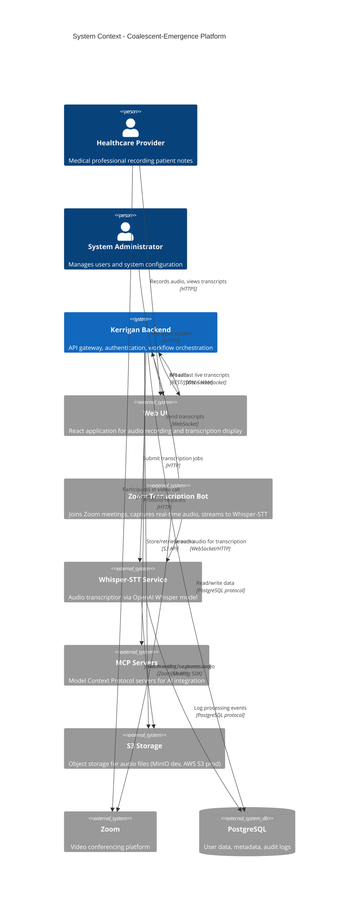
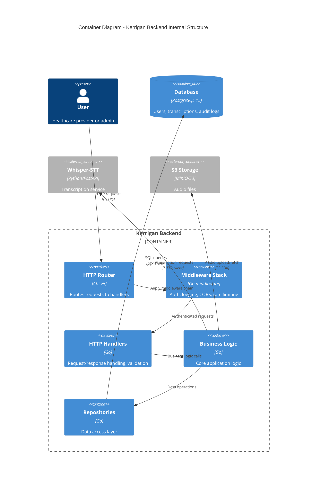
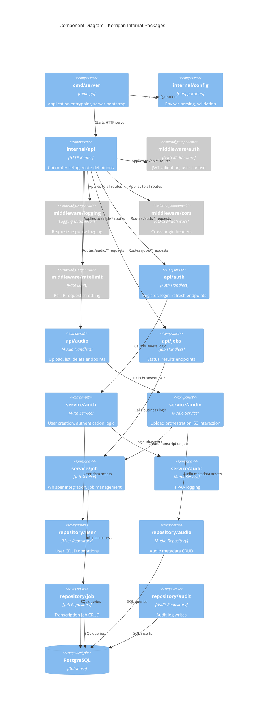
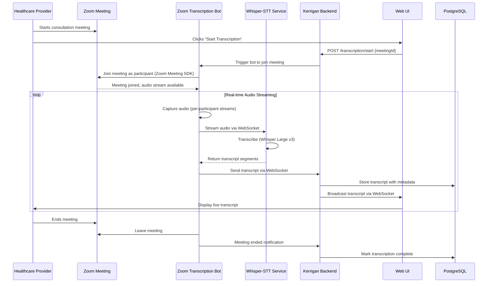

# Kerrigan Architecture

**Backend API Gateway and Workflow Orchestration**

Last Updated: February 14, 2026

## System Context (C4 Level 1)

Kerrigan sits at the center of the Coalescent-Emergence healthcare transcription platform, orchestrating communication between the web UI, specialized services (Whisper-STT, MCP servers), and data storage.



**Key Responsibilities**:
- **Authentication**: JWT issuance and validation
- **Authorization**: (MVP: all authenticated users have same permissions, RBAC post-MVP)
- **API Gateway**: Single entry point for UI, abstracts service complexity
- **Orchestration**: Coordinates multi-step workflows (upload → transcribe → return result, Zoom meeting transcription)
- **Real-time Communication**: WebSocket hub for live transcript broadcasting to UI
- **Audit Logging**: SOC2/HIPAA compliance trail

**External Dependencies**:
- **UI**: Sends user requests, displays results, receives live transcripts via WebSocket
- **Zoom Transcription Bot**: Joins Zoom meetings, captures real-time audio, sends transcripts to Kerrigan
- **Whisper-STT**: Processes audio (batch and streaming), returns transcriptions
- **Zoom**: Video conferencing platform for healthcare provider consultations
- **MCP Servers**: Provides AI context and protocol handling (future)
- **PostgreSQL**: Persistent data store
- **S3**: Audio file storage

## Container Diagram (C4 Level 2)

Kerrigan's internal structure shows how HTTP requests flow through layers.



**Request Flow Example** (Audio Upload):
1. User sends `POST /audio/upload` with JWT + audio file
2. Router matches route, applies middleware stack
3. Auth middleware validates JWT, extracts user ID
4. Rate limiting middleware checks request quota
5. CORS middleware allows origin
6. Handler validates file format and size
7. Service layer uploads to S3, creates DB record
8. Service submits job to Whisper-STT
9. Handler returns 202 Accepted with job ID

## Component Diagram (C4 Level 3)

Breakdown of Kerrigan's Go packages and their responsibilities.



## Package Responsibilities

### `cmd/server`
- Application entrypoint (`main.go`)
- Server bootstrap and graceful shutdown
- Dependency injection (connect services, repos, DB)

### `internal/config`
- Environment variable parsing
- Configuration validation
- Default values for missing configs

### `internal/api`
- HTTP router setup (Chi)
- Route definitions grouped by domain (auth, audio, jobs)
- Middleware application order

### `internal/middleware`
- **auth**: JWT validation, user context injection
- **logging**: Structured request/response logging (JSON format)
- **cors**: Cross-origin resource sharing headers
- **ratelimit**: Per-IP rate limiting using token bucket

### `internal/api/{domain}/handlers.go`
- HTTP request/response handling
- Input validation and parsing
- Calls service layer, returns JSON responses
- Error handling and HTTP status codes

### `internal/service`
- Business logic (e.g., "upload audio" orchestrates S3 upload + DB insert + Whisper job)
- Calls multiple repositories or external services
- Transaction management (if needed)
- Domain-specific error types

### `internal/repository`
- Data access layer (repository pattern)
- SQL query construction using pgx
- Database transaction handling
- No business logic (pure data access)

### `internal/audit`
- HIPAA/SOC2 audit logging service
- Writes structured logs to `audit_logs` table
- Captures: user ID, action, timestamp, IP address, resource accessed

## Zoom Real-time Transcription Architecture

**Decision**: [ADR-0005: Zoom Meeting SDK with Whisper-STT for Real-time Call Transcription](./decisions/0005-zoom-sdk-whisper-transcription.md)

### Overview

The platform supports real-time transcription of Zoom calls for healthcare consultations with <500ms latency. This enables healthcare providers to focus on patient care while the system automatically transcribes the conversation.

### Architecture Flow



### Components

#### 1. Zoom Transcription Bot (New Service)

**Technology**: JavaScript/TypeScript, Zoom Meeting SDK for Web  
**Hosting**: Vercel/Heroku or AWS/Azure VM  
**Responsibilities**:
- Join Zoom meetings programmatically using Zoom Meeting SDK
- Capture real-time audio streams (per-participant for speaker separation)
- Buffer and stream audio to Whisper-STT service
- Receive transcripts and forward to Kerrigan
- Handle meeting lifecycle (join, leave, reconnection)

**Key Features**:
- OAuth 2.0 authentication with Zoom
- Per-participant audio capture (enables speaker diarization)
- Audio buffering (50-100ms) for optimal STT latency
- WebSocket connections to Whisper and Kerrigan
- Automatic reconnection on network issues

#### 2. Kerrigan WebSocket Endpoints (Enhancement)

**New Endpoints**:
- `WS /transcription/stream` - Receive real-time transcripts from bot
- `WS /transcription/subscribe/{meetingId}` - UI subscribes to live transcripts

**Responsibilities**:
- Authenticate WebSocket connections (JWT validation)
- Receive transcript segments from bot
- Store transcripts in database with timestamps
- Broadcast to subscribed UI clients
- Audit log all transcription events

#### 3. Whisper-STT Service (Enhancement)

**Enhancement Required**: Real-time streaming mode  
**Responsibilities**:
- Accept audio streams via WebSocket
- Process audio with Whisper Large v3 model
- Return transcript segments with low latency (<200ms processing)
- Provide word-level timestamps

### Database Schema Updates

New table for real-time Zoom transcripts:

```sql
-- Zoom Meeting Transcripts
CREATE TABLE zoom_transcripts (
    id UUID PRIMARY KEY DEFAULT gen_random_uuid(),
    meeting_id VARCHAR(255) NOT NULL,
    user_id UUID REFERENCES users(id),
    participant_name VARCHAR(255),
    text TEXT NOT NULL,
    is_final BOOLEAN DEFAULT false,
    timestamp TIMESTAMPTZ NOT NULL,
    offset_ms INTEGER,
    created_at TIMESTAMPTZ DEFAULT NOW(),
    INDEX idx_meeting_id (meeting_id),
    INDEX idx_user_id (user_id),
    INDEX idx_timestamp (timestamp),
    INDEX idx_is_final (is_final)
);

-- Zoom Meeting Sessions
CREATE TABLE zoom_meeting_sessions (
    id UUID PRIMARY KEY DEFAULT gen_random_uuid(),
    meeting_id VARCHAR(255) UNIQUE NOT NULL,
    user_id UUID REFERENCES users(id),
    bot_joined_at TIMESTAMPTZ,
    bot_left_at TIMESTAMPTZ,
    status VARCHAR(20) NOT NULL, -- active, completed, failed
    participant_count INTEGER,
    created_at TIMESTAMPTZ DEFAULT NOW(),
    INDEX idx_user_id (user_id),
    INDEX idx_status (status)
);
```

### Latency Optimization

**Target**: <500ms from speech to transcript display in UI

**Latency Breakdown**:
- Audio capture (Zoom SDK): 50-100ms
- Network to Whisper: 20-50ms
- Whisper processing: 30-200ms
- Network to Kerrigan: 10-50ms
- WebSocket to UI: 10-30ms
- **Total: 120-430ms** ✅

**Optimizations**:
- Use WebSocket for all real-time communication (lower overhead than HTTP)
- Stream partial results immediately (don't wait for sentence completion)
- Buffer audio in 50-100ms chunks (balance latency vs quality)
- Host bot and Whisper in same region/VPC (minimize network latency)
- Use efficient audio codec (Opus, 16kHz mono)

### Security & Compliance

**Consent Mechanism**:
- Bot announces transcription when joining meeting (audio notification)
- Meeting participants see bot as visible participant
- Consent logged in database with timestamps
- Participants can request bot to leave (opt-out)

**HIPAA Compliance**:
- All transcripts are PHI and encrypted at rest (PostgreSQL encryption)
- Access to transcripts requires authentication and is audit logged
- WebSocket connections use TLS (WSS protocol)
- Data retention policies enforced (6-year minimum, configurable)

**Data Flow Security**:
- Bot ↔ Zoom: TLS (Zoom SDK handles encryption)
- Bot ↔ Whisper: WebSocket over TLS (WSS)
- Bot ↔ Kerrigan: WebSocket over TLS (WSS)
- Kerrigan ↔ UI: WebSocket over TLS (WSS)

### Cost Estimate

**Per 100 hours of meetings/month**:
- Zoom SDK License: ~$165/month (Pro SDK annual, amortized)
- Bot Hosting: ~$25/month (Vercel Pro or Heroku Hobby)
- Whisper-STT: ~$50-100/month (GPU compute, self-hosted)
- Network: ~$10/month
- **Total: ~$250-300/month** (~$2.50-3/hour)

Compare to Azure Speech alternative: ~$400-450/month (~$4-4.50/hour)

### Implementation Status

**Current Phase**: Design/Planning (ADR created)  
**Next Steps**:
1. Implement Zoom transcription bot (PoC - 1-2 weeks)
2. Add Kerrigan WebSocket endpoints
3. Enhance Whisper-STT for streaming mode
4. UI components for live transcript display
5. End-to-end testing and latency optimization

**Related Issues**: #4-#12 (implementation tasks)

## Database Schema

```sql
-- Users
CREATE TABLE users (
    id UUID PRIMARY KEY DEFAULT gen_random_uuid(),
    email VARCHAR(255) UNIQUE NOT NULL,
    password_hash VARCHAR(255) NOT NULL,
    created_at TIMESTAMP WITH TIME ZONE DEFAULT NOW(),
    updated_at TIMESTAMP WITH TIME ZONE DEFAULT NOW()
);

-- Refresh Tokens
CREATE TABLE refresh_tokens (
    id UUID PRIMARY KEY DEFAULT gen_random_uuid(),
    user_id UUID REFERENCES users(id) ON DELETE CASCADE,
    token_hash VARCHAR(255) NOT NULL,
    expires_at TIMESTAMP WITH TIME ZONE NOT NULL,
    created_at TIMESTAMP WITH TIME ZONE DEFAULT NOW(),
    INDEX idx_user_id (user_id),
    INDEX idx_expires_at (expires_at)
);

-- Audio Files
CREATE TABLE audio_files (
    id UUID PRIMARY KEY DEFAULT gen_random_uuid(),
    user_id UUID REFERENCES users(id) ON DELETE CASCADE,
    filename VARCHAR(255) NOT NULL,
    s3_key VARCHAR(512) NOT NULL,
    format VARCHAR(10) NOT NULL,
    size_bytes BIGINT NOT NULL,
    duration_seconds FLOAT,
    uploaded_at TIMESTAMP WITH TIME ZONE DEFAULT NOW(),
    INDEX idx_user_id (user_id)
);

-- Transcription Jobs
CREATE TABLE transcription_jobs (
    id UUID PRIMARY KEY DEFAULT gen_random_uuid(),
    audio_file_id UUID REFERENCES audio_files(id) ON DELETE CASCADE,
    user_id UUID REFERENCES users(id),
    status VARCHAR(20) NOT NULL, -- pending, processing, completed, failed
    whisper_job_id VARCHAR(255), -- External service job ID
    result_text TEXT,
    error_message TEXT,
    created_at TIMESTAMP WITH TIME ZONE DEFAULT NOW(),
    updated_at TIMESTAMP WITH TIME ZONE DEFAULT NOW(),
    completed_at TIMESTAMP WITH TIME ZONE,
    INDEX idx_user_id (user_id),
    INDEX idx_status (status),
    INDEX idx_audio_file_id (audio_file_id)
);

-- Audit Logs (HIPAA compliance)
CREATE TABLE audit_logs (
    id BIGSERIAL PRIMARY KEY,
    user_id UUID REFERENCES users(id),
    action VARCHAR(50) NOT NULL, -- login, upload, download, etc.
    resource_type VARCHAR(50), -- audio, transcription, user
    resource_id UUID,
    ip_address INET,
    user_agent TEXT,
    timestamp TIMESTAMP WITH TIME ZONE DEFAULT NOW(),
    INDEX idx_user_id (user_id),
    INDEX idx_timestamp (timestamp),
    INDEX idx_action (action)
);
```

**Migration Strategy**: Use [golang-migrate](https://github.com/golang-migrate/migrate) or [goose](https://github.com/pressly/goose)

## Technology Stack

See [tech-stack.md](./tech-stack.md) for detailed rationale.

**Core**:
- Go 1.23+
- Chi router (lightweight, middleware-friendly)
- pgx (PostgreSQL driver, fastest performance)

**Auth**:
- golang-jwt/jwt (JWT generation/validation)
- bcrypt (password hashing)

**Storage**:
- MinIO SDK (S3-compatible client, dev + prod)

**Testing**:
- testify (assertions, mocks)
- httptest (HTTP handler testing)

## Deployment Architecture

**MVP Deployment** (Docker Compose):

```
┌─────────────────┐
│   Traefik       │  ← Reverse proxy (SSL termination)
│   (Port 443)    │
└────────┬────────┘
         │
    ┌────┴────┐
    │         │
┌───▼────┐ ┌─▼──────┐
│Kerrigan│ │  UI    │
│:8080   │ │  :3000 │
└───┬────┘ └────────┘
    │
    ├─────┬──────┬──────┐
    ▼     ▼      ▼      ▼
┌──────┐┌────┐┌──────┐┌──────┐
│Postgre││Whis││MinIO ││Redis │
│SQL   ││per ││(S3)  ││      │
└──────┘└────┘└──────┘└──────┘
```

**Future Production** (Kubernetes):
- Auto-scaling Kerrigan pods (HPA based on CPU/memory)
- Managed PostgreSQL (AWS RDS/GCP Cloud SQL)
- Managed S3 (AWS S3/GCP Storage)
- Managed Redis (AWS ElastiCache)
- Prometheus/Grafana monitoring

## Security Considerations

### Authentication
- JWT HS256 signed with secret (RS256 post-MVP for distributed validation)
- Refresh tokens hashed in database (bcrypt)
- Rate limiting on `/auth/*` endpoints (5 req/min per IP)

### Authorization
- MVP: All authenticated users have equal permissions
- Post-MVP: RBAC with roles (admin, provider, readonly)

### Data Protection
- Passwords hashed with bcrypt (cost 12)
- JWTs expire after 15 minutes (short-lived)
- Refresh tokens expire after 7 days
- S3 audio files encrypted at rest
- Database connections use SSL in production

### HIPAA Compliance
- Audit logs capture all PHI access
- Audio files are PHI - access logged with user ID + timestamp
- Transcription results are PHI - access logged
- Ability to purge user data on request (HIPAA Right to Erasure)

## Performance Targets

| Metric | Target (MVP) | Target (Production) |
|--------|--------------|---------------------|
| API Latency (p95) | < 100ms | < 50ms |
| Throughput | 10 concurrent users | 1000 concurrent users |
| Database Connections | 25 max | Auto-scaled pool |
| Audio Upload Max Size | 100 MB | 500 MB |
| Transcription Processing | 30s avg | 10s avg (optimized Whisper) |

## Monitoring & Observability (Post-MVP)

- **Logs**: Structured JSON logs to stdout (Loki/CloudWatch)
- **Metrics**: Prometheus metrics (request count, latency, error rate)
- **Tracing**: OpenTelemetry (distributed tracing across Kerrigan → Whisper)
- **Alerts**: PagerDuty integration for critical errors

---

**Related Documents**:
- [MVP Scope](./mvp.md)
- [Tech Stack](./tech-stack.md)
- [API Documentation](./api.md)
- [ADRs](./decisions/)

**Organization ADRs**:
- [Multi-Repo Architecture](https://github.com/Coalescent-Emergence/.github/blob/main/docs/decisions/0001-multi-repo-architecture.md)
- [Layered Service Architecture](https://github.com/Coalescent-Emergence/.github/blob/main/docs/decisions/0003-layered-service-architecture.md)
