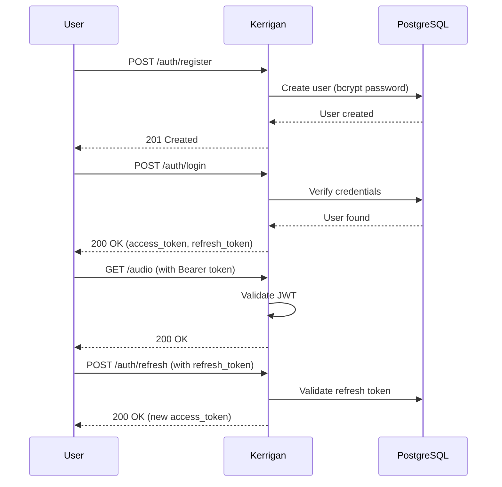

# Kerrigan API Documentation

**REST API specification for authentication and transcription orchestration**

Last Updated: February 12, 2026  
**Base URL**: `http://localhost:8080/api` (dev) | `https://api.example.com/api` (prod)  
**API Version**: v1 (implicit, future: `/api/v1/`)

---

## Authentication Flow



---

## Endpoints

### Authentication

#### POST /auth/register

Create a new user account.

**Request**:
```json
{
  "email": "user@example.com",
  "password": "SecureP@ssw0rd",
  "full_name": "Jane Doe"
}
```

**Validation**:
- `email`: Valid email format, max 255 chars, unique
- `password`: Min 8 chars, must contain uppercase, lowercase, number, special char
- `full_name`: Optional, max 100 chars

**Response** (201 Created):
```json
{
  "user_id": "550e8400-e29b-41d4-a716-446655440000",
  "email": "user@example.com",
  "full_name": "Jane Doe",
  "created_at": "2026-02-12T10:30:00Z"
}
```

**Errors**:
- `400 Bad Request`: Validation failed (weak password, invalid email)
- `409 Conflict`: Email already registered

---

#### POST /auth/login

Authenticate user and receive JWT tokens.

**Request**:
```json
{
  "email": "user@example.com",
  "password": "SecureP@ssw0rd"
}
```

**Response** (200 OK):
```json
{
  "access_token": "eyJhbGciOiJIUzI1NiIsInR5cCI6IkpXVCJ9...",
  "refresh_token": "a7b3c9d8e1f2g5h4i6j7k8l9m0n1o2p3",
  "token_type": "Bearer",
  "expires_in": 900,
  "user": {
    "user_id": "550e8400-e29b-41d4-a716-446655440000",
    "email": "user@example.com",
    "full_name": "Jane Doe"
  }
}
```

**JWT Claims** (access_token):
```json
{
  "user_id": "550e8400-e29b-41d4-a716-446655440000",
  "email": "user@example.com",
  "iat": 1676197800,
  "exp": 1676198700
}
```

**Errors**:
- `401 Unauthorized`: Invalid credentials
- `429 Too Many Requests`: >5 failed attempts in 15 minutes

---

#### POST /auth/refresh

Refresh access token using refresh token.

**Request**:
```json
{
  "refresh_token": "a7b3c9d8e1f2g5h4i6j7k8l9m0n1o2p3"
}
```

**Response** (200 OK):
```json
{
  "access_token": "eyJhbGciOiJIUzI1NiIsInR5cCI6IkpXVCJ9...",
  "token_type": "Bearer",
  "expires_in": 900
}
```

**Errors**:
- `401 Unauthorized`: Invalid or expired refresh token

---

### Audio Upload

#### POST /audio

Upload audio file for transcription.

**Authorization**: Required (`Authorization: Bearer <access_token>`)

**Request** (multipart/form-data):
```
Content-Type: multipart/form-data

------WebKitFormBoundary
Content-Disposition: form-data; name="file"; filename="recording.wav"
Content-Type: audio/wav

[binary audio data]
------WebKitFormBoundary
Content-Disposition: form-data; name="language"

en
------WebKitFormBoundary--
```

**Parameters**:
- `file`: Audio file (required)
  - **Supported formats**: WAV, MP3, M4A, FLAC, OGG
  - **Max size**: 100 MB (MVP), 500 MB (V1.0)
- `language`: ISO 639-1 code (optional, default: `en`)
  - Examples: `en`, `es`, `fr`, `de`

**Response** (202 Accepted):
```json
{
  "audio_id": "7c9e8b5a-3d4e-4f5a-9b6c-1a2b3c4d5e6f",
  "filename": "recording.wav",
  "size_bytes": 2048000,
  "duration_seconds": 120.5,
  "language": "en",
  "status": "uploaded",
  "s3_url": "s3://kerrigan-audio/users/550e8400.../7c9e8b5a.wav",
  "uploaded_at": "2026-02-12T10:35:00Z",
  "job_id": "9f8e7d6c-5b4a-3c2b-1a0f-9e8d7c6b5a4b"
}
```

**Errors**:
- `400 Bad Request`: Missing file, unsupported format, file too large
- `401 Unauthorized`: Invalid or missing JWT
- `413 Payload Too Large`: File exceeds size limit
- `429 Too Many Requests`: Upload rate limit exceeded (60/hour)

---

### Transcription Jobs

#### GET /jobs/:job_id

Get transcription job status.

**Authorization**: Required

**Response** (200 OK):
```json
{
  "job_id": "9f8e7d6c-5b4a-3c2b-1a0f-9e8d7c6b5a4b",
  "user_id": "550e8400-e29b-41d4-a716-446655440000",
  "audio_id": "7c9e8b5a-3d4e-4f5a-9b6c-1a2b3c4d5e6f",
  "status": "completed",
  "progress_percent": 100,
  "created_at": "2026-02-12T10:35:00Z",
  "started_at": "2026-02-12T10:35:05Z",
  "completed_at": "2026-02-12T10:35:30Z",
  "transcription_id": "1a2b3c4d-5e6f-7g8h-9i0j-1k2l3m4n5o6p",
  "error": null
}
```

**Status Values**:
- `pending`: Queued, waiting for processing
- `processing`: Whisper-STT is transcribing
- `completed`: Transcription ready
- `failed`: Error occurred (see `error` field)

**Errors**:
- `401 Unauthorized`: Invalid JWT
- `403 Forbidden`: Job belongs to different user
- `404 Not Found`: Job ID doesn't exist

---

#### GET /transcriptions/:transcription_id

Retrieve transcription result.

**Authorization**: Required

**Response** (200 OK):
```json
{
  "transcription_id": "1a2b3c4d-5e6f-7g8h-9i0j-1k2l3m4n5o6p",
  "audio_id": "7c9e8b5a-3d4e-4f5a-9b6c-1a2b3c4d5e6f",
  "job_id": "9f8e7d6c-5b4a-3c2b-1a0f-9e8d7c6b5a4b",
  "text": "This is the transcribed text from the audio file.",
  "language": "en",
  "confidence": 0.95,
  "duration_seconds": 120.5,
  "words": [
    {
      "word": "This",
      "start": 0.0,
      "end": 0.2,
      "confidence": 0.98
    },
    {
      "word": "is",
      "start": 0.2,
      "end": 0.35,
      "confidence": 0.99
    }
  ],
  "created_at": "2026-02-12T10:35:30Z"
}
```

**Query Parameters**:
- `include_words`: Include word-level timestamps (default: `false`)
  - Example: `GET /transcriptions/:id?include_words=true`

**Formats**:
- **JSON** (default): Full transcription object
- **Plain Text**: `Accept: text/plain` → returns only `text` field
- **SRT** (V1.1): `Accept: text/srt` → subtitle format
- **VTT** (V1.1): `Accept: text/vtt` → WebVTT format

**Errors**:
- `401 Unauthorized`: Invalid JWT
- `403 Forbidden`: Transcription belongs to different user
- `404 Not Found`: Transcription ID doesn't exist

---

### Health & Status

#### GET /health

Health check endpoint (no auth required).

**Response** (200 OK):
```json
{
  "status": "healthy",
  "version": "1.0.0",
  "timestamp": "2026-02-12T10:40:00Z",
  "services": {
    "database": "healthy",
    "s3": "healthy",
    "whisper_stt": "healthy"
  }
}
```

**Status Values**:
- `healthy`: All services operational
- `degraded`: Some services unavailable (returns 200 still)
- `unhealthy`: Critical failure (returns 503)

---

## Error Format

All errors follow this structure:

```json
{
  "error": {
    "code": "VALIDATION_ERROR",
    "message": "Password must be at least 8 characters",
    "details": {
      "field": "password",
      "requirement": "min_length"
    },
    "request_id": "req_abc123"
  }
}
```

**Error Codes**:
| Code | HTTP Status | Description |
|------|------------|-------------|
| `VALIDATION_ERROR` | 400 | Input validation failed |
| `UNAUTHORIZED` | 401 | Missing or invalid JWT |
| `FORBIDDEN` | 403 | Insufficient permissions |
| `NOT_FOUND` | 404 | Resource doesn't exist |
| `CONFLICT` | 409 | Resource already exists (e.g., duplicate email) |
| `PAYLOAD_TOO_LARGE` | 413 | File exceeds size limit |
| `RATE_LIMIT_EXCEEDED` | 429 | Too many requests |
| `INTERNAL_ERROR` | 500 | Server error |
| `SERVICE_UNAVAILABLE` | 503 | Dependency down (DB, S3, Whisper) |

---

## Rate Limits

| Endpoint | Limit | Window |
|----------|-------|--------|
| `POST /auth/register` | 5 requests | 1 hour |
| `POST /auth/login` | 10 requests | 15 minutes |
| `POST /audio` | 60 requests | 1 hour |
| All other endpoints | 600 requests | 1 hour |

**Rate Limit Headers**:
```
X-RateLimit-Limit: 60
X-RateLimit-Remaining: 45
X-RateLimit-Reset: 1676198700
```

**Rate Limit Error**:
```json
{
  "error": {
    "code": "RATE_LIMIT_EXCEEDED",
    "message": "Too many requests. Try again in 15 minutes.",
    "retry_after": 900
  }
}
```

---

## CORS Policy

**Allowed Origins** (dev): `http://localhost:3000`, `http://localhost:5173` (Vite)  
**Allowed Origins** (prod): `https://app.example.com`

**Allowed Headers**:
- `Authorization`
- `Content-Type`
- `X-Request-ID`

**Exposed Headers**:
- `X-RateLimit-*`

---

## OpenAPI Specification

Full OpenAPI 3.0 spec available at:
- **Dev**: `http://localhost:8080/api/openapi.yaml`
- **Prod**: `https://api.example.com/api/openapi.yaml`

**Swagger UI** (V1.0+): `/api/docs`

---

**Related Documents**:
- [Architecture](./architecture.md) - System design
- [Development Guide](./development.md) - Testing API locally
- [Tech Stack](./tech-stack.md) - Libraries used

**Implementation Status**:
- ✅ Endpoints defined
- 🔄 OpenAPI spec (TODO: generate from code)
- 🔄 Go handlers (TODO: implement)
- 🔄 Integration tests (TODO: write)
